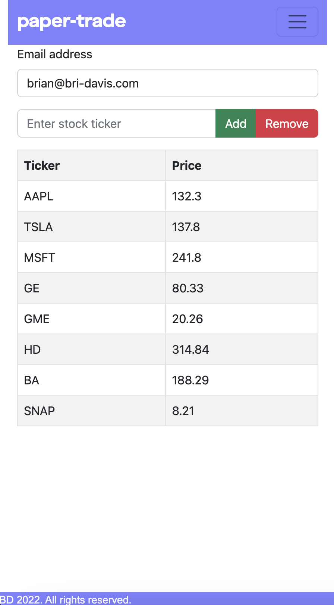
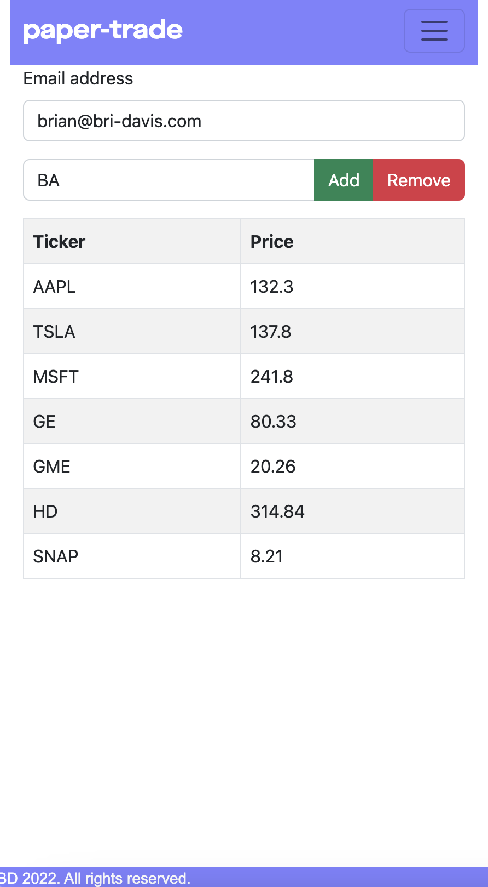

# paper-trade

paper-trade is an interactive React.js web application that allow users to add/remove stocks to/from a watchlist and view stock prices. It is intended for beginner investors to learn about stocks and track their stock trades.

<p align="center">


</p>


## How to Run

1. Clone the repo into your personal space:

```bash
git clone https://github.com/bri-davis/paper-trade.git
cd paper-trade
```

2. Install the following Python packages for backend usage:

```
pip3 install boto3
pip3 install botocore
pip3 install flask
pip3 install flask-cors
pip3 install yfinance
```
3. Create an AWS account, then create a DynamoDB table and name it 'paper-trade'.

4. In the src/backend/ folder, create .aws/credentials and enter your AWS ID and Access Key

```
[default]
aws_access_key_id = ...
aws_secret_access_key = ... 
```
5. In the src/backend/ directory, you can run the Python Flask backend using: 

```
flask run
```

6. Install the following Node packages for frontend usage:

```
npm -i react-bootstrap
npm -i react-router-dom
```
7. In the project directory, you can run the frontend using:

### `npm start`

Runs the app in the development mode.\
Open [http://localhost:3000](http://localhost:3000) to view it in your browser.

The page will reload when you make changes.\
You may also see any lint errors in the console.

## Tech Stack

[React.js](https://reactjs.org) - Frontend Development
[Python](https://www.python.org) - Backend Development
[Flask](https://flask.palletsprojects.com/en/2.2.x/) - Python web framework
[AWS DynamoDB](https://aws.amazon.com/dynamodb/) - Database


## MIT License
This project is licensed under the MIT License - see the LICENSE.md file for details


## Future Considerations
- Using [IEX Cloud API](https://iexcloud.io/docs/api/) over yfinance
- Switching current schema to be entirely hosted on AWS using EC2
- More personalized user interaction with email subcription-based lists

## Learn More

You can learn more in the [Create React App documentation](https://facebook.github.io/create-react-app/docs/getting-started).

To learn React, check out the [React documentation](https://reactjs.org/).
